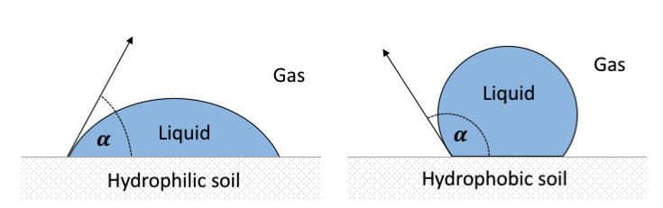
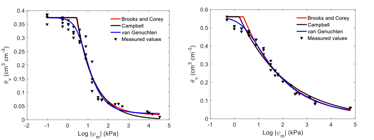

# 3. Soil Water Content and Water Potential

## 3.1 Soil water content

When the United States National Aeronautics and Space Administration (NASA) was building the Phoenix Mars Lander to explore the surface of Mars, the project leaders contacted soil physicists to create a special sensor for the rover’s robotic arm (Fig. 3‑1). The purpose of that sensor was to test for the presence of water in the Martian soil. The fascinating story of the resulting partnership between NASA and soil scientists is recounted in this [video](https://youtu.be/wW1zlgFRP4c). The NASA scientists knew that finding water on Mars was key to answering questions about the possibility of life on that hostile planet. Water is the life-blood of the soil. Almost all terrestrial life and almost all soil biological, chemical, and physical processes are influenced by the water content of the soil.

<figure class='half-width'>
	
  	<figcaption>Fig. 3‑1.  NASA's Phoenix Mars Lander's Robotic Arm with its thermal and electrical conductivity 				probe at the lower right, pointing toward the Martian soil (July 14, 2008).**
				Photo credit: NASA/JPL <a href="https://www.jpl.nasa.gov/news/news.php?feature=1787">Link</a>
	</figcaption>
</figure>

In the prior chapter we considered the multi-scale patterns, structure, and texture associated with the soil solid phase. In this chapter we will turn our attention to the soil liquid phase, which we will simply refer to as soil water in most cases. It is important to keep in mind however, that the soil liquid phase is not simply water, but rather a complex solution containing organic and inorganic solutes, not to mention the micro-organisms and colloids often suspended in the solution. The soil water is in some ways analogous to a river transporting life-giving, and sometimes life-threatening, solutes, organisms, and colloids. But those are topics for another chapter. Here we will focus on the amount and the condition of soil water.

## 3.1.1. Soil water terminology

As you continue to study soil physical properties and processes, you will need to know and use the following key terms related to soil water content.

- **Gravimetric water content** ($\theta_g$) is the mass of water per unit mass of oven-dry soil particles. It has dimensions of mass over mass and may be written as a unitless decimal, as a percentage, or as a decimal with units of kg kg-1 or g g-1. We will use the latter in this book. For mineral soils it ranges from approximately 0 to 0.60 $g \ g^{-1}$. Organic soils may have higher values.

- **Volumetric water content** ($\theta$) is the volume of water per unit volume of soil. It has dimensions of volume over volume and may be written as a unitless decimal, as a percentage, or as a decimal with units of $m^3 m^{-3}$ or cm3 cm-3. We will use the latter in this book. For mineral soils it ranges from approximately 0 to 0.60 $cm^3 cm^{-3}$. Organic soils may have higher values. When gravimetric water content is known, the volumetric water content can be calculated using the soil bulk density ($\rho_b$) and the density of water ($\rho_w$). This relationship is further explained in this video.

<iframe width="560" height="315" src="https://www.youtube.com/embed/cGcJ9QEISSk" frameborder="1" allow="accelerometer; autoplay; encrypted-media; gyroscope; picture-in-picture" allowfullscreen></iframe>

- **Soil water storage** (S) is the equivalent depth of soil water contained in a soil layer of a specified thickness (z). It has dimensions of length and may be written as cm or mm. If the volumetric water content of the layer is known, then the soil water storage is calculated by

### 3.1.2 Soil water content measurement techniques

Knowing the amount of water contained in the soil is important, not only in the search for life on Mars, but also for understanding and managing life on Earth. Researchers in disciplines such as soil science, hydrology, ecology, agronomy, meteorology, and civil engineering often need accurate measurements of soil water content; as do farmers, horticulturalists, turf managers, and government agencies responsible for managing natural resources. Since around the end of the World War II, researchers have been continually developing new methods for measuring soil water content to meet the needs of these diverse user groups [1]. We will briefly consider a few of those measurement techniques here.

The simplest and oldest method for measuring soil water content is called the gravimetric method. In this method, a soil sample is weighed, then oven-dried at 105C to a constant weight and the final dry weight is recorded. This drying temperature is above the boiling temperature for water but below temperatures at which soil organic matter would be lost by heating. If the volume of the soil sample is unknown, then only the gravimetric water content can be  determined using this method. If the volume of the sample is known, then the bulk density and volumetric water content can also be determined. In practice, a fixed drying time of 24 hours is often used because it is more convenient than repeatedly weighing the sample to determine if a constant weight has been reached. The primary requirements for this method then are an accurate balance and an oven that can safely hold a constant temperature unattended for 24 hours.

In contrast to the simplicity of the gravimetric method, powerful new methods of measuring and monitoring soil water content involve a diverse array of cutting-edge technologies. Now satellites orbit the Earth carefully mapping the emission of electromagnetic radiation from the land surface in the microwave wavelength range, and these data are used to estimate the volumetric water content of the 0-5 cm soil layer around the globe with ~9 km spatial resolution [2, 3]. Researchers are also learning to extract information about soil water content from the satellite-generated signals received by antennas of Global Positioning Systems because a portion of those signals comes from reflections off the land surface [4, 5]. 

Meanwhile, neutrons generated by cosmic-rays are detected with stationary or mobile neutron counters at the land surface and used to estimate volumetric water content of the surface soil to a depth of up to 40 cm with a spatial resolution of ~400 m [6, 7]. For higher spatial resolution, researchers deploy fiber optic distributed temperature sensing systems with or without active heating capabilities. These systems can measure soil temperatures at 1-m resolution and 1-min intervals along paths of 1-km length or greater, and the soil temperature data can be used to infer soil volumetric water content [8, 9]. Fig. 3‑2 shows some of the equipment in a field experiment called the Marena, Oklahoma, In Situ Sensor Testbed (MOISST) where many of the established and emerging soil moisture measurement technologies are inter-compared [10].

<figure class='full-width'>
	
  	<figcaption>Fig. 3‑2. Sensors at the Marena, Oklahoma, In Situ Sensor Testbed (MOISST) site including sensors 				for the cosmic-ray neutron method (white box on right) and GPS reflectometry method (gray domes on 				masts), as well as numerous types of below ground soil water content sensors.
	  </figcaption>
</figure>

Add to these techniques the steady progression of new electromagnetic and thermal sensors that permit long-term, automated monitoring of soil volumetric water content at a single point [11] , a progression that began with the seminal work of Topp et al. [12] who used a technique called time domain reflectometry (TDR). You can see that development of improved methods for measuring soil water content has been a major focus in soil physics and related disciplines, and you can understand why soil water content data are becoming increasingly available around the world [13]. One of the great opportunities for researchers today is to find creative ways to use these data for societal benefit whether for improved drought monitoring, more accurate streamflow forecasting, increased wildfire preparedness, or a host of other potential applications [14-16].

## 3.2 Soil water potential

Knowing the soil water content is useful for many applications, but there is another variable which is equally important to understanding soil water processes, and that variable is called soil water potential. Soil water potential is a measure of the potential energy of the soil solution. Potential energy is energy that a substance or object has by virtue of its location or internal condition, and potential energy is always defined relative to some reference condition. For example, a book resting on a table has less potential energy than the same book would have if you held it in the air above the table. If you release the book, it will spontaneously fall back down to the table due to the force of gravity. In this case, the increased potential energy came from raising the book upward against the Earth’s gravitational field, and the book’s spontaneous fall when released illustrates the general tendency of things to move from locations of higher to lower potential energy.

### 3.2.1 Soil water potential terminology

Thus, soil water potential () is the potential energy of the soil solution relative to that of water in standard reference state. By convention, that state is defined by:

- pure water
- at atmospheric pressure
- at the same temperature as the soil solution
- at a specified, constant elevation.

Differences in soil water potential cause water in soil to flow from regions of higher water potential to regions of lower water potential. When the water potential is equal throughout a certain region of soil, then that region has reached a condition called equilibrium. At equilibrium, there is no water flow. The concept of equilibrium is important for theoretical purposes and laboratory experiments but rarely, if ever, occurs in the field.

Most scientists consider the total soil water potential to be the simple sum of component potentials from several contributing factors, most notably: gravitational potential, osmotic potential, and pressure potential.

- Gravitational potential (g) is the potential energy which is due to the position of substance or object in a gravitational field. Gravitational potential is measured with respect to an arbitrary reference elevation.

- Osmotic potential (o) is the decrease in the water potential which is due to the presence of solutes. Osmotic potential affects soil water flow whenever there is a gradient in solute concentration within the soil. Such gradients are especially persistent where there is a membrane, such as the wall of a plant cell, or a barrier, such as the soil surface, that restricts the movement of either water or solutes.

- Pressure potential ($\psi_p$) refers to the soil water potential attributable to any other factors besides gravity and solutes. Factors such as capillarity, adsorption, submergence, and air pressure can all influence the pressure potential.

  - Matric potential ($\psi_m$) is an important subcategory of pressure potential. Matric potential is the decrease in the water potential due to the interaction of water with the soil’s solid matrix, primarily through capillarity and adsorption.

Soil water potential can be expressed in a variety of different ways, creating some opportunity for confusion. The three most common ways of expressing soil water potential are:

- Energy per unit mass (J kg-1) is perhaps the most fundamental and theoretically sound way to express soil water potential but is not as widely used the other two.

- Energy per unit volume (J m-3 or kPa) has the same units as pressure and is convenient for expressing pressure potential and osmotic potential. However, some uncertainty can arise with this form of expression since the density of water, and thus the relation of mass to volume, is slightly temperature dependent.

- Energy per unit weight ($J N^{-1}$ or $m$ or $cm$) is sometimes referred to as hydraulic head and, when the water flow velocity is negligibly small, is indicated by the height of the free water surface above or below a specified reference elevation. This way of expressing water potential is often convenient for solving soil water flow problems.

In this book we will primarily use energy per unit volume ($kPa$) and energy per unit weight (m or cm) to express soil water potential. A helpful conversion to remember is that 1 kPa = 10.2 cm of water. Soil water potentials vary over several orders of magnitude.  A soil in which the pore spaces are completely filled with water would have a matric potential of 0 kPa, while a surface soil exposed to dry atmospheric conditions for extended periods of time would have a matric potential far below -1500 kPa.

### 3.2.2 Soil water potential measurement techniques

Measurements of soil water potential or its components are used by researchers to understand water movement in the soil-plant-atmosphere continuum and by crop and turf managers to guide irrigation management. The oldest type of measuring device for this purpose is called a tensiometer, which consists of a ceramic cup connected to a water reservoir and a pressure gauge (Fig. 3‑3). When the cup is embedded in the soil, water flows into or out of the reservoir through the ceramic until the water potential inside the cup is equal to the water potential outside the cup.

<figure class='half-width'>
	
  	<figcaption>Fig. 3‑3. Tensiometer. Photo credit: Soil Moisture Equipment Corp</figcaption>
</figure>

The movement of water into or out of the reservoir causes the pressure at the location of the pressure gauge to increase or decrease relative to atmospheric pressure. The gauge pressure, corrected for the height of the water column between the cup and the gauge, indicates the pressure potential or matric potential at the location of the cup. Tensiometers do not indicate osmotic potential because solutes can move freely through the ceramic. Tensiometers are typically limited to measuring pressure potentials greater than approximately -80 kPa, below which air passes through the ceramic and invalidates the pressure gauge reading.

A more recent measurement technique for matric potential utilizes heat dissipation sensors which can provide matric potential measurements at potentials far below the tensiometer range. Heat dissipation sensors consist of a small temperature sensor and a heating element encased in the center of a ceramic plug (Fig. 3‑4). When the sensor is embedded in soil, water moves into or out of the ceramic until the matric potential inside the ceramic equilibrates with the matric potential in the surrounding soil. A pulse of electric current passed through the heater generates a temperature rise which is recorded using the temperature sensor.

<figure class='half-width'>
	
  	<figcaption>Fig. 3‑4. Heat dissipation sensor</figcaption>
</figure>

The magnitude of the temperature rise is related to the absolute value of the matric potential. If the soil and ceramic are relatively dry, the temperature rise will be large, and the matric potential will be some large negative number. If the soil and ceramic are relatively wet, the temperature rise will be small, and the matric potential will be some small negative number. Heat dissipation sensors lose sensitivity when the ceramic is saturated and thus have an upper measurement limit of approximately -10 kPa.

Soil water potential can also be measured on soil samples in the laboratory using an instrument such as a dewpoint potentiometer. A small soil sample is placed inside the instrument in a sealed chamber containing a small mirror (Fig. 3‑5). The water potential of the air in the space above the sample equilibrates with the soil water potential, and the instrument lowers the temperature of the mirror until finding the precise temperature at which dew forms on the mirror. Based on this dewpoint temperature, the water potential of the soil sample is determined. This instrument can measure water potentials over a large range but is even less sensitive in the wet range than are heat dissipation sensors. Current dewpoint potentiometers have an upper limit of approximately -100 kPa.

<figure class='half-width'>
	
  	<figcaption>Fig. 3‑5. Dewpoint potentiometer.</figcaption>
</figure>

## 3.3. Soil Water Retention

If you have ever taken a walk along a sandy beach, you probably observed that there is a place quite near the water’s edge where the ground is dry enough and firm enough to easily walk on. In contrast, if you have walked along the edge of a lake or pond where the surrounding soil was fine-textured, you probably found that the ground near the water’s edge was wet and muddy. The differences you experienced in those two cases can be partly explained by the differing capabilities of coarse- and fine-textured soils to retain, or store, water. These capabilities are described by a relationship called the soil water retention curve. The soil water retention curve is the relationship between soil water content and matric potential. Understanding this relationship is crucial to understanding processes such as soil water storage, water flow, and plant water uptake.

### 3.3.1 Features of soil water retention curves

The most fundamental concept to understand about soil water retention is that soil water content is positively related to soil matric potential. As soil water content decreases, matric potential also decreases, becoming more negative. When all the pores in a soil are filled with water, the soil is at its saturated water content (s) and the matric potential is 0. Consider the water retention curve for the Rothamsted loam shown in Fig. 3‑6. The intersection of the solid curve with the left-hand y-axis shows that for this soil s is approximately 0.51 cm3 cm-3. 

As we move to the right along the solid curve, we are moving toward more negative values of matric potential. The absolute value of matric potential, rather than matric potential itself, is plotted on the x-axis in this figure, as is common for water retention curve plots. The absolute value of matric potential is sometimes called suction. Using the absolute value for matric potential allows us to use a logarithmic scale for matric potential to compensate for its large numerical range relative to that of soil water content.

<figure class='full-width'>
	
  	<figcaption>Fig. 3‑6. Soil water retention curves for a sand (L-soil), a sandy loam (Royal), and a loam (Rothamsted). The symbols are measured data and the solid lines are models fit to the data. Adapted from Rossi and Nimmo (1994).
</figcaption>
</figure>

The water retention curve for the Rothamsted loam is flat between 100 cm (i.e. 1 cm) and approximately 102 cm (100 cm), then at lower matric potentials the curve bends downward. The highest matric potential at which air has displaced water in some of the pores of a previously saturated soil is called the air-entry potential (e). For this Rothamsted loam the air-entry potential was estimated to be -128 cm of water. 
As we follow the water retention curve toward the right from the air-entry potential, we encounter a region where the decrease in water content is relatively large for each corresponding decrease in matric potential. There is a subtle inflection point approximately halfway down the descending limb of the water retention curve where the shape changes from concave to convex. The location of this inflection point may have some practical significance for soil management. The water content at this inflection point may be the optimum water content for tillage, resulting in the greatest proportion of small aggregates [17], and the slope of the curve at the inflection point may be a useful indicator of soil quality [18].
To the right of the inflection point, the steep portion of the curve tapers off into a relatively flat portion of the curve when the matric potential takes on large negative values. In this tail of the water retention curve, large decreases in matric potential are associated with only small decreases in soil water content.

### 3.3.2 Soil properties affecting soil water retention

Another fundamental characteristic of soil water retention curves is that coarse-textured soils retain less water than fine textured soils at the same matric potential. Consider the substantial differences in the curves for the sand (L-soil), sandy loam (Royal), and loam (Rothamsted) textured soils in Fig. 3‑6. The sand exhibits a much lower saturated water content than the loam, in this case 0.18 cm3 cm-3 versus 0.51 cm3 cm-3. The sand also has a higher (less negative) air-entry potential than the loam, -32 cm versus -128 cm. The water retention for the medium-textured sandy loam soil is intermediate between those of the other two soils. Throughout the subsequent chapters, one common theme will be how these substantial differences in water retention between different soil textures dramatically influence water movement, plant growth, and related processes in both managed and natural ecosystems.

A secondary influence on soil water retention is the soil bulk density (Fig. 3‑7). If you compare compacted and un-compacted samples of the same soil, the compacted soil will typically have a lower porosity, lower saturated water content, and lower air-entry potential. Sufficiently compacted soils can also have higher water contents for matric potentials below the air-entry potential than a similar un-compacted soil. This pattern is evident for the samples with the highest bulk density in Fig. 3‑7 [19].

<figure class='full-width'>
	
  	<figcaption>Fig. 3‑7. Water retention curves for samples of a silt loam soil at different levels of compaction indicated by the bulk density values ranging from 1.01 to 1.34 g cm-3. Adapted from Stange and Horne (2005).
</figcaption>
</figure>

Advocates for conservation tillage, cover crops, soil quality, and, more recently, soil health have often stated that increasing soil organic matter improves soil water retention. However, the scientific evidence for this claim is somewhat unclear. While a number of studies have found that increasing organic matter increases soil water retention, a similar number of studies have found no such effect [20]. One plausible hypothesis is that in some soils increasing organic matter results in decreased bulk density, leading indirectly to positive effects on water retention similar to those shown in Fig. 3‑7.

### 3.3.3 Hysteresis in soil water retention

The soil water retention curve can also be influenced by whether the soil is undergoing wetting (sorption) or drying (desorption). When the soil water retention curve differs between wetting and drying, that phenomenon is called hysteresis. This phenomenon has a number of important effects on soil water dynamics. For example, hysteresis in the water retention curve can increase the amount of water that is stored near the soil surface after an infiltration and drainage event [21]. Hysteresis can also slow the rate of solute leaching in soil under natural rainfall conditions with greater effects in coarse-textured than fine-textured soils [22]. In subsequent chapters, we will further consider the effects of hysteresis. For now, we will examine its nature and causes.

<figure class='full-width'>
	
  	<figcaption>Fig. 3‑8. Wetting and drying curves for an engineered silty clay loam soil exhibiting strong hysteresis for matric potentials between -1 and -1000 kPa. Degree of saturation is the volumetric water content divided by the saturated water content. Adapted from Tsiampousi et al. (2013).
</figcaption>
</figure>

For a soil exhibiting hysteresis, the equilibrium water content associated with any particular matric potential will be lower for a wetting curve than for a drying curve (Fig. 3‑8). The initial water content for the wetting or drying process also plays a role. Notice in Fig. 3‑8 the clear difference in the drying curve for the silty clay loam soil when the drying process began from full saturation compared to when the drying process began at a lower water content indicated by the point labeled “B” [23].
Hysteresis in the soil water retention curve has multiple possible causes including: air entrapment, contact angle hysteresis, and the “ink bottle” effect. Air-entrapment occurs when a partially-drained soil is rewetted and small pockets of air become trapped in the interior pore spaces. This entrapped air cannot easily be removed, even if the soil is submerged underwater. As a result, higher water contents occur along the primary drainage curve from a fully saturated condition than those that occur during subsequent re-wetting (e.g. Fig. 3‑8). Due to air-entrapment during re-wetting, the soil water content approaches a maximum value below the true saturated water content and this lower value is sometimes called the satiated water content. The image in Fig. 3‑9 was generated by X-ray computed tomography and shows air-entrapment in the complex macropore network of a satiated soil column [24]. Soil chemical, physical, and biological processes can alter the amount and distribution of entrapped air over time, so the impact of air-entrapment on soil water retention can change with each subsequent re-wetting cycle.

<figure class='half-width'>
	
  	<figcaption>Fig. 3‑9. Three dimensional visualizations of (a) porosity (gray) and entrapped air (pink) and (b) macropore network of a satiated 30-cm long column of a silt loam soil taken from the surface of cropland under no-till management. Adapted from Luo et al. (2008).
</figcaption>
</figure>

A second potential cause of hysteresis in the soil water retention curve is a phenomenon known as contact angle hysteresis. The contact angle is the angle at which a liquid-gas interface meets a solid surface (Fig. 3‑10). In our context, this means the angle at which the interface between the soil solution and the soil gas phase contacts the soil solids. Mineral soils often have contact angles <90 and are classified as hydrophilic, i.e. having affinity for water. Organic soils and mineral soils in which much of the surface area becomes covered with organic coatings can have contact angles >90, making them hydrophobic, i.e. tending to repel water.

To visualize contact angle hysteresis and how it may affect soil water retention, a thought experiment may help. Imagine if we added a sufficiently small volume of liquid to the drop in Fig. 3‑10a, the edge of the drop would not move but the contact angle would increase slightly. Likewise if we removed a sufficiently small amount of liquid, the contact angle would decrease slightly. Thus, contact angles for wetting and drying processes are different, i.e. contact angles exhibit hysteresis. The larger contact angles during wetting versus drying lead to higher (less negative) pressure potentials for the same water contents, consistent with Fig. 3‑8.

<figure class='full-width'>
	
  	<figcaption>Fig. 3‑10. Contact angles for hydrophilic and hydrophobic soils. The contact angle () is the angle from the solid surface to the liquid-gas interface, passing through the liquid.
</figcaption>
</figure>

A third potential cause for hysteresis is the ink bottle effect, which refers to the way in which drainage from a relatively large cavity, such as the body of an old-fashioned ink bottle, can be restricted if the fluid must drain through a relatively narrow opening, such as the neck of an inverted ink bottle. The analogy is somewhat helpful, but to better understand how this phenomenon influences soil water retention, we need to understand an important related phenomenon called capillary rise. Capillary rise is the rise of liquid against the force of gravity due to the upward force produced by the attraction of the liquid molecules to a solid surface and to each other.
When you insert a small diameter tube, or capillary, into a fluid, such as water, the surface of the fluid inside the capillary may rise above that of the surrounding fluid, and the height (h) of this capillary rise is described by:

$$ h = \frac{2 \gamma \alpha}{\rho g r} \tag{3.1} $$

where  is the surface tension of the fluid (N m-1),  is the contact angle of the liquid-gas interface on the wall of the tube,  is the fluid density (kg m-3), g is the acceleration due to gravity (m s-2), and r is the radius of the capillary (m). Thus, the smaller the radius of the capillary, the greater the height of the capillary rise. To better understand this equation, watch this video. The pressure potential just below the capillary meniscus is simply the negative of the capillary rise.

<iframe width="100%" height="500" src="https://www.youtube.com/embed/DfQ8tkXgUxI" frameborder="0" allow="accelerometer; autoplay; encrypted-media; gyroscope; picture-in-picture" allowfullscreen></iframe>

<figure class='half-width'>
	
  	<figcaption>Fig. 3‑11. Illustration of the “ink bottle effect” during wetting. Adapted from Ng and Pang (2000).
</figcaption>
</figure>

In Fig. 3‑11, two capillary tubes have been inserted into water. The height of the resulting capillary rise was greater for the uniformly narrow tube on the right than for the non-uniform tube on the left. During this filling or wetting phase, capillary rise could only raise water to the bottom of the tube section with the enlarged diameter. If instead both tubes had drained from an initially water filled condition, then the enlarged section would have remained water-filled and height of water in both tubes would have been equal. Thus, for capillary tubes or soil pores with non-uniform radii, that non-uniformity can cause hysteresis in the water retention curve [25].

### 3.3.4 Measuring soil water retention curves

Because of the complexity of soil pore networks, we are currently unable to theoretically predict soil water retention curves from first principles, although progress has been made and is being made toward that goal [26, 27]. Until that goal is achieved, we will continue to determine soil water retention curves primarily by empirical methods, i.e. methods based on measurements and experience rather than theory or logical reasoning. Measurements of soil water retention are typically, but not always, performed in the laboratory with different methods being suitable for different portions of the possible range in soil matric potential. Near saturation, intact soil samples should be used because the soil structure and inter-aggregate pores can strongly influence water retention. At matric potentials below approximately –15 kPa, the effects of soil structure on water retention appear to be negligible [28] and smaller homogenized soil samples are typically used.

For matric potentials between 0 kPa and approximately -10 kPa, a simple hanging water column or tension table is often used to precisely control a sample’s matric potential (Fig. 3‑12a). When the sample reaches equilibrium with the imposed matric potential, i.e. when water stops flowing, the water content of the sample can be determined by the change in the mass of the sample. For matric potentials between -10 and -100 kPa, small pressurized chambers often called Tempe cells work well, particularly for intact soil samples (Fig. 3‑12b). A special porous ceramic plate at the bottom of the chamber, when saturated, allows water, but not air, to flow out of the chamber. The air pressure is increased to the absolute value of the desired matric potential, and once equilibrium is reached, the water content of the sample is determined based on the volume of water which flowed out of the sample or the change in mass of the sample. For matric potentials between -100 and -1500 kPa, specialized pressure plates in larger chambers have often been used (Fig. 3‑12c). The principle of operation is similar to that of Tempe cells, but smaller samples of homogenized soil are used with each chamber housing multiple samples, and sometimes even multiple pressure plates. At these low matric potentials, true equilibrium may take many weeks or may never be reached, and a growing body of research suggests that data from pressure plate measurements may be unreliable at matric potentials below -100 kPa [29-31]. Dewpoint potentiometers (Fig. 3‑5) offer one alternative measurement approach in this matric potential range.

<figure class='full-width'>
	
  	<figcaption>Fig. 3-12. Laboratory devices for measuring soil water retention include: hanging water column (a), Tempe cells (b), and pressure plate extractors (c). Image credits: (a) Nasta et al. (2011), (b) and (c) Soil Moisture Equipment Corp.
</figcaption>
</figure>

### 3.3.5 Mathematical functions for soil water retention

Once we have measured soil water retention at several values of matric potential, we often need to fit a mathematical function to the measurements to allow calculation of water content for all other possible values of matric potential. One of the earliest widely-used water retention functions, developed by Brooks and Corey [32], is defined by:

$$ \frac{\theta - \theta_r}{\theta_s - \theta_r} = \bigg( \frac{\psi_e}{\psi_m} \bigg)^ \lambda \hspace{10mm} \text{for} \hspace{2mm} \psi_m < \psi_e  \tag{Eq. 3-3}$$

where $\theta_r$ is the **residual water content**, which is conceptually the water content below which liquid water flow in the soil is no longer possible, $\psi_e$ is the air-entry potential, and $\lambda$ is a number related to the pore size distribution of the soil. Larger values of $\lambda$ indicate more uniformly-sized pores, while small values indicate a wide distribution of pore sizes are present.

A slightly simpler water retention function that is more convenient to use when performing calculations by hand was developed by Campbell [33] and is defined by:
	
$$ \frac{\theta}{\theta_s} = \bigg( \frac{\psi_e}{\psi_m} \bigg) ^ \frac{1}{b} \hspace{10mm} \text{for} \hspace{2mm} \psi_m < \psi_e  \tag{Eq. 3-4}$$

where again $b$ is a parameter related to the pore size distribution. The Campbell water retention function does not include a residual water content.
A more flexible and more widely-used water retention function was developed later by van Genuchten [34]. That function is defined by:

$$ \frac{\theta - \theta_r}{\theta_s - \theta_r} = \bigg[ 1 + (-\alpha \psi_m)^n \bigg] ^ {-m} \tag{Eq. 3-5}$$

where $\alpha$ is a parameter that is inversely related to the air-entry potential, $n$ is a pore size distribution index similar to $\lambda$, and $m$ is a parameter often defined by $m = 1 – 1/n$.

<figure class='full-width'>
	
  	<figcaption>Fig. 3-13. Measured water retention curves for Tifton loamy sand (a) and Waukegan silt
loam (b) plotted as black triangles along with solid lines showing the Brooks and Corey,
Campbell, and van Genuchten water retention functions fit to the data.</a>
	</figcaption>
</figure>

The most accurate way to estimate the parameters needed for these water retention functions is to obtain measurements of soil water retention across a broad range of matric potentials and then to adjust the parameters to achieve the best possible agreement with the measured values. Measured water retention curves for a loamy sand and a silt loam soil are shown in Fig. 3‑13 along with best-fits of the Brooks and Corey, Campbell, and van Genuchten water retention functions. All three functions fit the data reasonably, with the primary difference in this case being the sharp drop in water content at the air-entry potential predicted by the Brooks and Corey and the Campbell functions. The optimized parameters for each function are listed in Table 3‑1 along with the root mean square error (RMSE), which is a measure of the error in the water content values estimated using the fitted function. For these two soils, all three functions fit the measured data well, but the van Genuchten function has the lowest RMSE.

**Table 3-1. Best fit parameters for the Brooks and Corey, Campbell, and van
Genuchten water retention functions for samples of Tifton sandy loam and
Waukegan silt loam. The root mean square error (RMSE) is also shown to indicate
the quality of the fit.**

| Soil               | Function           | $\theta_{sat}$   | $\theta_{res}$   | $\lambda$, $b$, or $n$     | $\psi_e$ or $\alpha$   | RMSE           |
|--------------------|:------------------:|:----------------:|:----------------:|:------------------------:|:----------------------:|:----------------:|
|                    |                    | $cm^3 cm^{-3}$   | $cm^3 cm^{-3}$   |          -               | kPa or kPa{-1}         | $cm^3 cm^{-3}$   |
| Tifton sandy loam  | Brooks and Corey   | 0.374            | 0.017            | 0.550                    | -2.87                  | 0.031            |
|                    | Campbell           | 0.374            | -                | 2.06                     | -2.75                  | 0.032            |
|                    | van Genuchten      | 0.374            | 0.023            | 1.74                     | 0.211                  | 0.025            |
|                    |                    |                  |                  |                          |                        |                  |
| Waukegan silt loam | Brooks and Corey   | 0.561            | 0.002            | 0.254                    | -2.34                  | 0.03             |
|                    | Campbell           | 0.561            | -                | 4.49                     | -1.58                  | 0.029            |
|                    | van Genuchten      | 0.561            | 0.018            | 1.30                     | 0.299                  | 0.018            |

If you do not have measurements of soil water retention for a particular soil, you can get a general idea of the shape of the water retention curve simply by knowing the soil textural class. Table 3‑2 provides estimates of the parameters for the Brooks and Corey, van Genuchten, and Campbell water retention functions based on 

**Table 3-2. Average parameters for the Brooks and Corey, van Genuchten, and
Campbell soil water retention functions by USDA soil textural class. The residual
water content ($\theta_r$), saturated water content ($\theta_s$), $\alpha$, and $n$ values were based on
Schaap et al. (2001), the air-entry potential ($\psi_e$) and $\lambda$ values were taken from
Rawls et al. (1982), and the b values were taken from Rawls et al. (1992). Variables
followed by a * are the back-transformed log mean for the textural class.**

| Textural class  |   $\theta_r$   |   $\theta_s$   | $\psi_e^*$ | $\lambda^*$ | $\alpha^*$ |  $n$ | $b$ |
|-----------------|:--------------:|:--------------:|:----------:|:-----------:|:----------:|:----:|:---:|
|                 | $cm^3 cm^{-3}$ | $cm^3 cm^{-3}$ |    $cm$    |             |  $cm^{-1}$ |      |     |
| Clay            |      0.098     |      0.459     |    -37.3   |    0.131    |   0.0150   | 1.25 | 7.6 |
| Clay loam       |      0.079     |      0.442     |    -25.9   |    0.194    |   0.0158   | 1.42 | 5.2 |
| Loam            |      0.061     |      0.399     |    -11.2   |    0.220    |   0.0111   | 1.47 | 4.5 |
| Loamy sand      |      0.049     |      0.390     |    -8.69   |    0.474    |   0.0348   | 1.75 | 2.1 |
| Sand            |      0.053     |      0.375     |    -7.26   |    0.592    |   0.0352   | 3.18 | 1.7 |
| Sandy clay      |      0.117     |      0.385     |    -29.2   |    0.168    |   0.0334   | 1.21 | 6.0 |
| Sandy clay loam |      0.063     |      0.384     |    -28.1   |    0.250    |   0.0211   | 1.33 | 4.0 |
| Sandy loam      |      0.039     |      0.387     |    -14.7   |    0.322    |   0.0267   | 1.45 | 4.7 |
| Silt            |      0.050     |      0.489     |      -     |      -      |   0.0066   | 1.68 |  -  |
| Silty clay      |      0.111     |      0.481     |    -34.2   |    0.127    |   0.0162   | 1.32 | 7.9 |
| Silty clay loam |      0.090     |      0.482     |    -32.6   |    0.151    |   0.0084   | 1.52 | 6.6 |
| Silty loam      |      0.065     |      0.439     |    -20.8   |    0.211    |   0.0051   | 1.66 | 4.7 |

## 3.4 Problem Set

1. A cylindrical soil sample of 3.85 cm diameter and 10.00 cm height weights 201.13 g. The sample is then oven dried at 105oC for 48 hours, reaching a final weight of 177.75 g. Assume a particle density of 2.65 g cm-3 and density of water 1.00 g cm-3. Calculate the sample’s:

 a. bulk density

 b. porosity

 c. gravimetric and volumetric water contents

 d. soil water storage in mm
2. Calculate the soil water storage in mm for a 60 cm deep soil profile in which the A horizon is 25 cm thick and has a volumetric water content of 0.25 cm3 cm-3 and the B horizon is 35 cm thick and has a volumetric water content of 0.35 cm3 cm-3.
3. Determine the correct value for x in the simplified capillary rise equation below using Eq. 3-2 and assuming a contact angle of 20. For water, assume a surface tension of 7.3 x 10-2 N m-1 (1 N m-1 = 1 kg s-2) and density of 998 kg m-3.
4. Use the result from the prior question to calculate the height of capillary rise in a 0.010 mm diameter capillary tube.
5. Use the Campbell water retention function and data from Table 3-2 to find the volumetric water content of a sand and a clay loam at -10. kPa and -1500. kPa.

## 3.5 References

1. Topp, C.G. and P.A. Ferré, 3.1 Water Content, in Methods of Soil Analysis: Part 4 Physical Methods, J.H. Dane and C.G. Topp, Editors. 2002, Soil Science Society of America: Madison, Wisconsin. p. 417-546.
2. Entekhabi, D., et al., The soil moisture active passive (SMAP) mission. Proceedings of the IEEE, 2010. 98(5): p. 704-716.
3. Kerr, Y.H., et al., The SMOS mission: New tool for monitoring key elements of the global water cycle. Proceedings of the IEEE, 2010. 98(5): p. 666-687.
4. Larson, K.M., et al., Use of GPS receivers as a soil moisture network for water cycle studies. Geophys. Res. Lett., 2008. 35(24): p. L24405.
5. Small, E.E., et al., Validation of GPS-IR Soil Moisture Retrievals: Comparison of Different Algorithms to Remove Vegetation Effects. IEEE Journal of Selected Topics in Applied Earth Observations and Remote Sensing, 2016. PP(99): p. 1-12.
6. Dong, J., et al., Calibration and validation of the COSMOS rover for surface soil moisture measurement. Vadose Zone Journal, 2014.
7. Zreda, M., et al., COSMOS: The COsmic-ray Soil Moisture Observing System. Hydrology and Earth System Sciences, 2012. 16(11): p. 4079.
8. Dong, J., et al., Determining soil moisture and soil properties in vegetated areas by assimilating soil temperatures. Water Resources Research, 2016. 52(6): p. 4280-4300.
9. Sayde, C., et al., Feasibility of soil moisture monitoring with heated fiber optics. Water Resources Research, 2010. 46(6): p. W06201.
10. Cosh, M.H., et al., The Soil Moisture Active Passive Marena, Oklahoma, In Situ Sensor Testbed (SMAP-MOISST): Testbed Design and Evaluation of In Situ Sensors. Vadose Zone Journal, 2016. 15(4).
11. Robinson, D.A., et al., Soil Moisture Measurement for Ecological and Hydrological Watershed-Scale Observatories: A Review. Vadose Zone J, 2008. 7(1): p. 358-389.
12. Topp, G.C., J.L. Davis, and A.P. Annan, Electomagnetic determination of soil water content: Measurements in coaxial transmission lines. Water Resources Research, 1980. 16: p. 574-582.
13. Ochsner, T.E., et al., State of the Art in Large-Scale Soil Moisture Monitoring. Soil Science Society of America Journal, 2013. 77(6): p. 1888-1919.
14. Krueger, E.S., et al., Concurrent and antecedent soil moisture relate positively or negatively to probability of large wildfires depending on season. International Journal of Wildland Fire, 2016. 25(6): p. 657-668.
15. Rosenberg, E.A., A.W. Wood, and A.C. Steinemann, Informing Hydrometric Network Design for Statistical Seasonal Streamflow Forecasts. Journal of Hydrometeorology, 2013. 14(5): p. 1587-1604.
16. Torres, G.M., R.P. Lollato, and T.E. Ochsner, Comparison of Drought Probability Assessments Based on Atmospheric Water Deficit and Soil Water Deficit. Agron. J., 2013. 105(2): p. 428-436.
17. Dexter, A.R. and N.R.A. Bird, Methods for predicting the optimum and the range of soil water contents for tillage based on the water retention curve. Soil and Tillage Research, 2001. 57(4): p. 203-212.
18. Dexter, A.R., Soil physical quality: Part I. Theory, effects of soil texture, density, and organic matter, and effects on root growth. Geoderma, 2004. 120(3–4): p. 201-214.
19. Stange, C.F. and R. Horn, Modeling the Soil Water Retention Curve for Conditions of Variable Porosity. Vadose Zone Journal, 2005. 4(3): p. 602-613.
20. Rawls, W.J., et al., Effect of soil organic carbon on soil water retention. Geoderma, 2003. 116(1–2): p. 61-76.
21. Rubin, J., Numerical Method for Analyzing Hysteresis-Affected, Post-Infiltration Redistribution of Soil Moisture1. Soil Science Society of America Journal, 1967. 31(1): p. 13-20.
22. Persson, M. and A. Saifadeen, Effects of hysteresis, rainfall dynamics, and temporal resolution of rainfall input data in solute transport modelling in uncropped soil. Hydrological Sciences Journal, 2016. 61(5): p. 982-990.
23. Tsiampousi, A., L. Zdravkovic, and D.M. Potts, A three-dimensional hysteretic soil water retention curve. Geotechnique, 2013. 63(2): p. 155-164.
24. Luo, L., H. Lin, and P. Halleck, Quantifying Soil Structure and Preferential Flow in Intact Soil Using X-ray Computed Tomography. Soil Science Society of America Journal, 2008. 72(4): p. 1058-1069.
25. Ng, C.W. and Y. Pang, Experimental investigations of the soil-water characteristics of a volcanic soil. Canadian Geotechnical Journal, 2000. 37(6): p. 1252-1264.
26. Assouline, S., D. Tessier, and A. Bruand, A conceptual model of the soil water retention curve. Water Resources Research, 1998. 34(2): p. 223-231.
27. Or, D. and M. Tuller, Liquid retention and interfacial area in variably saturated porous media: Upscaling from single-pore to sample-scale model. Water Resources Research, 1999. 35(12): p. 3591-3605.
28. Nimmo, J.R., Modeling Structural Influences on Soil Water Retention. Soil Science Society of America Journal, 1997. 61(3): p. 712-719.
29. Bittelli, M. and M. Flury, Errors in Water Retention Curves Determined with Pressure Plates. Soil Science Society of America Journal, 2009. 73(5): p. 1453-1460.
30. Gee, G.W., et al., The Influence of Hydraulic Nonequilibrium on Pressure Plate Data. Vadose Zone Journal, 2002. 1(1): p. 172-178.
31. Solone, R., et al., Errors in water retention curves determined with pressure plates: Effects on the soil water balance. Journal of Hydrology, 2012. 470–471: p. 65-74.
32. Brooks, R. and A. Corey, Hydraulic Properties of Porous Media. Hydrology Papers, Colorado State University, 1964(March).
33. Campbell, G.S., A Simple Method for Determining Unsaturated Conductivity From Moisture Retention Data. Soil Science, 1974. 117(6): p. 311-314.
34. van Genuchten, M.T., A Closed-form Equation for Predicting the Hydraulic Conductivity of Unsaturated Soils. Soil Science Society of America Journal, 1980. 44: p. 892-898.
35. Rawls, W., D. Brakensiek, and K. Saxtonn, Estimation of soil water properties. Transactions of the ASAE, 1982. 25(5): p. 1316-1320.
36. Rawls, W.J., L.R. Ahuja, and D.L. Brakensiek, Estimating soil hydraulic properties from soils data, in Indirect Methods for Estimating the Hydraulic Properties of Unsaturated Soils, M.T. van Genuchten, F.J. Leij, and L.J. Lund, Editors. 1992, Univ. of California, Riverside: Riverside, California. p. 329-340.
37. Schaap, M.G., F.J. Leij, and M.T. van Genuchten, ROSETTA: a computer program for estimating soil hydraulic parameters with hierarchical pedotransfer functions. Journal of Hydrology, 2001. 251(3-4): p. 163-176.
